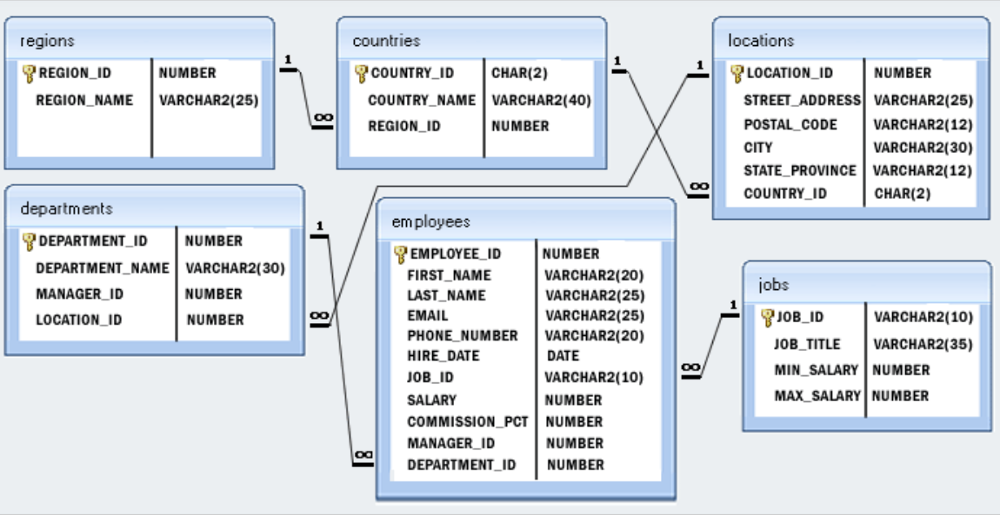

# SQL_daily_tasks_small_company


There is an example database containing the following tables: Regions, Countries, Locations, Departments, Employees, Job History, and Jobs. The primary objective is to develop CRUD operations in PL/SQL based on the business requirements. To achieve this, we aim to utilize various Schema objects like Cursors, Triggers, Stored Procedures, and Functions. Additionally, there are specific tasks where I will implement Collection data types such as nested tables.

## Task 1
### Functional requirements
Provide CRUD operations to the Regions table but the solution should be consumable for other schema objects as well. 
- insert_region: Accepts REGION_ID and REGION_NAME as parameters and inserts a new region into the regions table.
- update_region: Accepts REGION_ID and REGION_NAME as parameters and updates the region with the specified REGION_ID in the regions table.
- delete_region: Accepts REGION_ID as a parameter and deletes the region with the specified REGION_ID from the regions table.
- get_region: Accepts REGION_ID as a parameter and retrieves the region with the specified REGION_ID from the regions table.
### Technical requirements
- Using PL/SQL Scehma objects.

## Task 2
Enforce data integrity between the regions and countries' tables
- It should check if the REGION_ID being inserted/updated exists in the regions table before allowing the modification.
    - If the REGION_ID doesn't exist in the regions table,       appropriate error handling should be implemented to prevent invalid data from being inserted or updated.

## Task 3
Create a Schema object in a logical file system for Retrieve employees in a given department which can be used by back-end developers.
### Technical requirements
- Exception handling should be implemented to handle cases where no employees are found for the given department.
- Using PL/SQL Schema objects is required.
- It is not allowed to use primitive data types.

## Task 4
Calculate the average salary of employees in a specific job
### Technical requirements
- Exception handling should be implemented to handle cases where no employees are found for the given job.
- Solution should be stored logical file system of the database

## Task 5
### Functional requirements
Some tasks were done in a daily manner. They should be made reusable and stored as Schema objects in the Oracle database. Also, they can be used for new enterprise applications therefore all of them should be stored under the same Schema object. In total, 4 tasks should be designed and implemented. Secondly, they should be collected under the same Schema object. Finally, a unit test should be written for each of 4 tasks, and the unit test for each task should be stored in 
- List all the departments and the number of employees per each department
- List the employees with the lowest salary per each department
- Display the number of employees per city having not less than 34 employees
- List the 2 jobs with the maximum number of employees and the respective minimum and
maximum salary per job.
- List the lowest and highest salary per city, the total number of employees per city, the number of employees earning the lowest salary, the number of employees earning the highest salary, the percentage of employees earning the highest salary per city, and the percentage of employees earning the lowest salary per city. This information should be shown as 1 row per city containing all the information requested.
### Technical requirements
- Exception handling should be implemented for some tasks.
- Solutions should be stored logical file system of the database

## Task 6
Think yourself SQL statement which could be useful according data model for database users.
Please substantiate your point of view and shortly explain what you did.

To help you with these exercises you will find the data model here:


## Task 7
There is some query which has bugs.
``` plsql
select *
from(
SELECT a.fisrt_name,a.last_name,a.job_id
FROM employees A
WHERE A.slary &gt;(Select avg(salary) from employees)) and a.slary &lt; select
(max(slary) from employees)
) b
where b.job_id=SY_ANA;
```

- Analyze result of query
- If there is some bug in mentioned query, fix it
